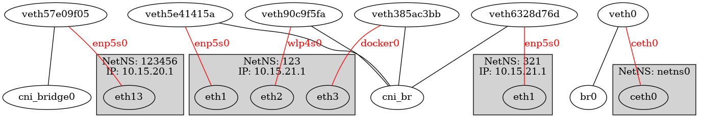

# iftree

CLI, easy way to illustrate local network interface.

The intent is for understanding container networks :D

## example
```
# sudo go run main.go

----------------------------------------------------
BRIDGE: cni_br    up
netnsName         veth    peer    peerInNetns    netnsID
|____321
     |----veth6328d76d    enp5s0    eth1    3
|____123
     |----veth5e41415a    enp5s0     eth1    2
     |----veth90c9f5fa    wlp4s0     eth2    2
     |----veth385ac3bb    docker0    eth3    2

----------------------------------------------------
unused veth pair without
veth            peer        netnsID
veth31bc095b    enp5s0      1
veth12d98148    wlp4s0      1
veth-tt1        veth-tt     -1
veth-tt         veth-tt1    -1
```

## graph output
### prequisite
Create an ouput image with any [graphviz](http://www.graphviz.org/download) compatible renderer

```
# sudo go run cmd/iftree/main.go --graph | dot -Tpng  > output.png
or
# sudo go run cmd/iftree/main.go --graph > xx.dot
# dot -Tpng xx.dot > output.png
```
### example output


### roadmap

- [x] show peer name in container
- [x] graphviz
- [ ] rich text
- [ ] topo relation in ascii graph
- [ ] support more networking device