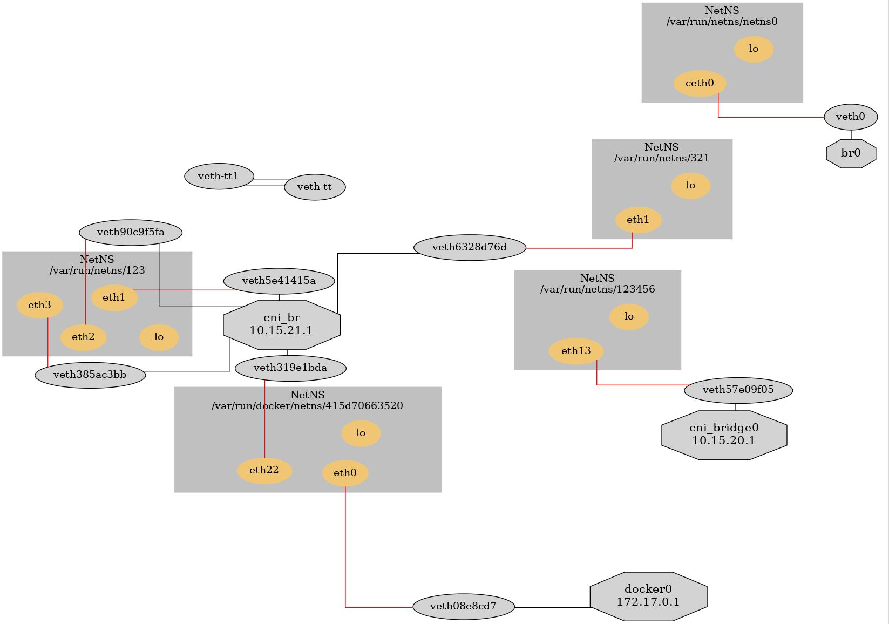

[](https://github.com/TianZong48/iftree/actions/workflows/golangci-lint.yml)
[](https://github.com/TianZong48/iftree/actions/workflows/codeql-analysis.yml)
[](https://goreportcard.com/badge/github.com/TianZong48/iftree)

# iftree

CLI, easy way to illustrate local network interface.

The intent is for understanding container networks :D



### features

- [x] visualize Veth/bridge connections
- [x] support graphviz
- [x] table output
- [ ] rich text
- [ ] ascii graph
- [ ] support more networking device

## usage

```
Usage:
  iftree [options]
    -d, --debug   print debug message
    -g, --graph   output in graphviz dot language(https://graphviz.org/doc/info/lang.html
    -t, --table   output in table
Help Options:
    -h, --help       Show this help message
```
### graph

Create an ouput image with [graphviz](https://www.graphviz.org/) compatible renderer.
e.g: online editor: https://dreampuf.github.io/GraphvizOnline

```
# sudo go run cmd/iftree/main.go --graph 
```

generate image using `dot`(http://www.graphviz.org/download/#executable-packages)

```
# sudo go run cmd/iftree/main.go --graph | dot -Tpng  > output.png
```


### text

```
# sudo go run main.go

----------------------------------------------------
BRIDGE: br0    up
netnsName      veth    peerInNetns    netnsID
└────/var/run/netns/netns0
     ├────veth0    ceth0    4

----------------------------------------------------
BRIDGE: docker0    up
netnsName          veth    peerInNetns    netnsID
└────/var/run/docker/netns/883628ab52b7
     ├────veth4f13cd2    eth0    5

----------------------------------------------------
BRIDGE: cni_bridge0    up
netnsName              veth    peerInNetns    netnsID
└────/var/run/netns/123456
     ├────veth57e09f05    eth13    0
└────/var/run/docker/netns/0de88faa84ac
     ├────veth31bc095b    eth0    1
     ├────veth12d98148    eth1    1

----------------------------------------------------
BRIDGE: cni_br    up
netnsName         veth    peerInNetns    netnsID
└────/var/run/netns/321
     ├────veth6328d76d    eth1    3
└────/var/run/netns/123
     ├────veth5e41415a    eth1    2
     ├────veth90c9f5fa    eth2    2
     ├────veth385ac3bb    eth3    2

----------------------------------------------------
unused veth pairs
VETH        PEER        NETNSID
veth-tt1    veth-tt     -1
veth-tt     veth-tt1    -1
```

### table

```
sudo go run cmd/iftree/main.go --table
+---+-------------+------------------------------------+--------------+-------------------+
|   | BRIDGE      | NETNS                              | VETH         | IFNAME(CONTAINER) |
+---+-------------+------------------------------------+--------------+-------------------+
| 1 | br0         | /var/run/netns/netns0              | veth0        | ceth0             |
+---+-------------+------------------------------------+--------------+-------------------+
| 2 | docker0     | /var/run/docker/netns/415d70663520 | veth08e8cd7  | eth0              |
+---+-------------+------------------------------------+--------------+-------------------+
| 3 | cni_bridge0 | /var/run/netns/123456              | veth57e09f05 | eth13             |
+---+-------------+------------------------------------+--------------+-------------------+
| 4 | cni_br      | /var/run/netns/123                 | veth5e41415a | eth1              |
+---+             |                                    +--------------+-------------------+
| 5 |             |                                    | veth90c9f5fa | eth2              |
+---+             |                                    +--------------+-------------------+
| 6 |             |                                    | veth385ac3bb | eth3              |
+---+             +------------------------------------+--------------+-------------------+
| 7 |             | /var/run/netns/321                 | veth6328d76d | eth1              |
+---+             +------------------------------------+--------------+-------------------+
| 8 |             | /var/run/docker/netns/415d70663520 | veth319e1bda | eth22             |
+---+-------------+------------------------------------+--------------+-------------------+
```